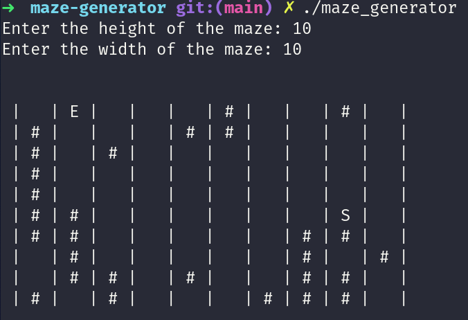
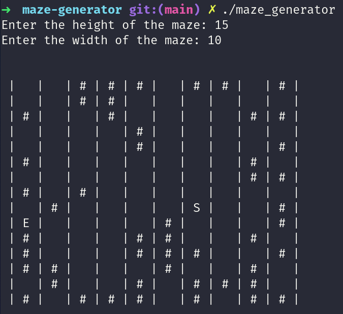

# C++ Maze Generator

This is a simple maze generator app written in some basic C++. It accepts an arbitrary width and height for the maze.

## Installation


```bash
git clone git@github.com:daniel-schroeder-dev/cpp-maze-generator.git
cd cpp-maze-generator
```

## Usage

If you're running Linux, you may be able to just run the executable that's included:

```bash
./maze_generator
```

Otherwise, you can compile the `.cpp` file and run that using whatever compiler you have on your machine. Here's how I do it with `g++`:

```bash
g++ maze_generator.cpp -o maze_generator && ./maze_generator
```

The start position is represented as `S` and the end position is `E`. The program builds a valid path between the start and the end position first, then adds the wall characters (`#`) and removes the path. So, there's guaranteed to be a valid path through the maze.

## Example Mazes

### 10x10



### 15x10



### 20x20


## Contributing
Pull requests are welcome. For major changes, please open an issue first to discuss what you would like to change.

## License
[MIT](https://choosealicense.com/licenses/mit/)
